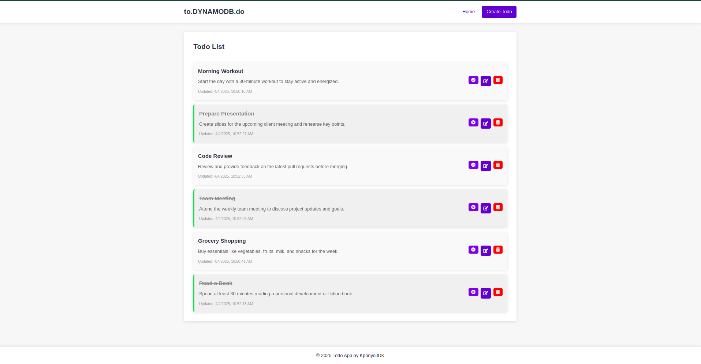

# Todo App with Node.js, EJS, and DynamoDB

A complete task management application built using Node.js, Express, EJS templating, and Amazon DynamoDB. This application follows the MVC (Model-View-Controller) architecture pattern and provides a comprehensive, responsive UI for managing your todo items.



## Features

- **Complete CRUD Operations**
  - Create new todo items
  - View all todos in a clean, responsive interface
  - Update existing todo information
  - Delete todos
  - Toggle completion status

- **Responsive Design**
  - Mobile-friendly interface
  - Clean, modern UI with animations
  - Intuitive user experience

- **MVC Architecture**
  - Organized code structure
  - Separation of concerns
  - Maintainable and scalable

- **DynamoDB Integration**
  - Serverless NoSQL database
  - Automatic table creation
  - Efficient data operations

## Demo

[Live Demo](https://your-demo-url.com) (Update with your deployed URL)

## Table of Contents

- [Installation](#installation)
- [Environment Setup](#environment-setup)
- [Usage](#usage)
- [Project Structure](#project-structure)
- [API Endpoints](#api-endpoints)
- [DynamoDB Schema](#dynamodb-schema)
- [Technologies Used](#technologies-used)
- [Contributing](#contributing)
- [License](#license)

## Installation

1. Clone the repository:
   ```bash
   git clone https://github.com/yourusername/todo-app-dynamodb.git
   cd todo-app-dynamodb
   ```

2. Install dependencies:
   ```bash
   npm install
   ```

## Environment Setup

Create a `.env` file in the root directory with the following variables:

```
AWS_REGION=us-east-1
AWS_ACCESS_KEY_ID=your_access_key
AWS_SECRET_ACCESS_KEY=your_secret_key
DYNAMODB_TABLE_NAME=TodoItems
PORT=3000
```

### Setting up AWS Credentials

1. Create an AWS account if you don't have one
2. Create an IAM user with DynamoDB permissions
3. Generate access keys for the IAM user
4. Add these credentials to your `.env` file

## Usage

1. Start the application:
   ```bash
   npm start
   ```

2. For development with auto-restart:
   ```bash
   npm run dev
   ```

3. Access the application at:
   ```
   http://localhost:3000
   ```

## Project Structure

```
todo-app/
├── config/
│   └── db.js                  # DynamoDB configuration
├── controllers/
│   └── todoController.js      # Request handlers
├── models/
│   └── Todo.js                # Data models and DB operations
├── public/
│   ├── css/
│   │   └── style.css          # Styling
│   └── js/
│       └── main.js            # Client-side scripts
├── routes/
│   └── todoRoutes.js          # Route definitions
├── views/
│   ├── layouts/
│   │   └── main.ejs           # Main layout
│   ├── partials/
│   │   ├── header.ejs         # Header partial
│   │   └── footer.ejs         # Footer partial
│   ├── index.ejs              # Todo list view
│   ├── create.ejs             # Create todo form
│   └── edit.ejs               # Edit todo form
├── app.js                     # Application entry point
├── package.json               # Dependencies and scripts
└── .env                       # Environment variables
```

## API Endpoints

| Method | URL                  | Description                  |
|--------|----------------------|------------------------------|
| GET    | /                    | Get all todos                |
| GET    | /create              | Show create form             |
| POST   | /create              | Create new todo              |
| GET    | /edit/:id            | Show edit form               |
| PUT    | /edit/:id            | Update todo                  |
| PATCH  | /toggle/:id          | Toggle completion status     |
| DELETE | /delete/:id          | Delete todo                  |

## DynamoDB Schema

### TodoItems Table

| Attribute  | Type   | Description                                    |
|------------|--------|------------------------------------------------|
| id         | String | Primary key (UUID)                            |
| title      | String | Todo title                                    |
| description| String | Todo description (optional)                   |
| completed  | Boolean| Completion status                             |
| createdAt  | String | ISO timestamp of creation                     |
| updatedAt  | String | ISO timestamp of last update                  |

## Technologies Used

- **Backend**
  - Node.js
  - Express.js
  - AWS SDK for JavaScript
  - UUID for generating unique IDs

- **Frontend**
  - EJS (Embedded JavaScript Templates)
  - CSS3 with Flexbox
  - JavaScript (ES6+)
  - Font Awesome icons

- **Database**
  - Amazon DynamoDB

- **DevOps**
  - Nodemon for development
  - Environment variables with dotenv
  - Method-override for RESTful routes

## Contributing

1. Fork the repository
2. Create your feature branch (`git checkout -b feature/amazing-feature`)
3. Commit your changes (`git commit -m 'Add some amazing feature'`)
4. Push to the branch (`git push origin feature/amazing-feature`)
5. Open a Pull Request

## License

This project is licensed under the MIT License - see the [LICENSE](LICENSE) file for details.

## Acknowledgements

- [Express.js](https://expressjs.com/)
- [AWS DynamoDB Documentation](https://aws.amazon.com/dynamodb/)
- [EJS](https://ejs.co/)
- [Font Awesome](https://fontawesome.com/)

---

Created by [Kponyo JDK](https://github.com/nullstead) - feel free to contact me!